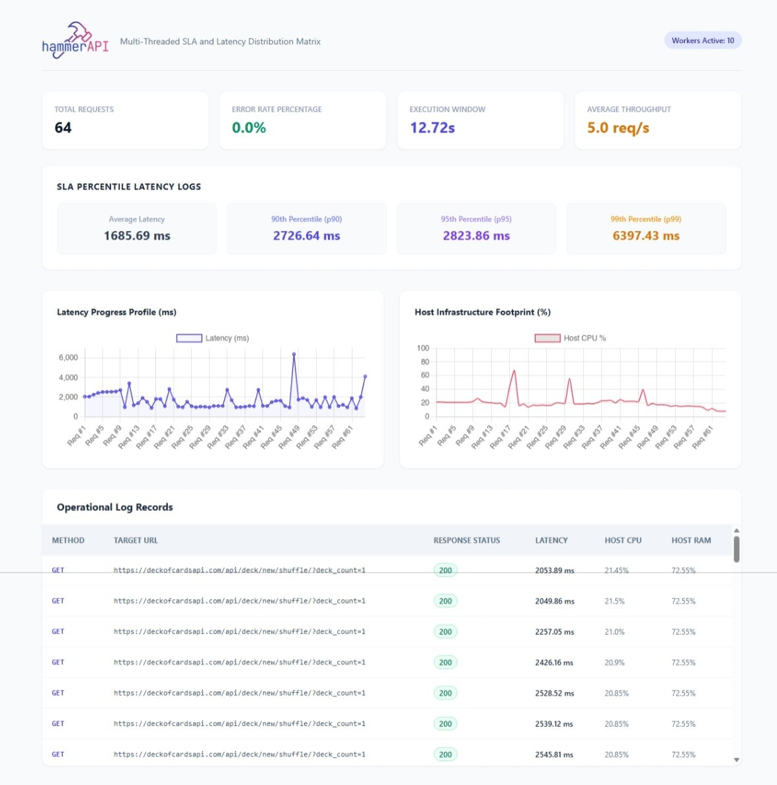

<p align="center">
  
</p>

# 🔨 HammerAPI

[](https://pypi.org/project/hammerapi/)
[](https://opensource.org/licenses/MIT)

A lightweight, blazing-fast, multi-threaded API performance and load testing library for Python.

**HammerAPI** helps developers, QA engineers, SREs, and performance testers stress-test REST APIs with minimal code while automatically collecting local machine telemetry (CPU/RAM) and generating beautiful interactive HTML reports.

---

## 🚀 Installation

```bash
pip install hammerapi
```

---

## ✨ Features

### 🧵 Concurrent API Execution

Run hundreds or thousands of requests using a configurable thread pool.

### ⏱️ Multiple Execution Modes

* Run each test case exactly once
* Run continuously for a fixed duration
* Mix multiple endpoints in the same workload

### 🌐 Full HTTP Support

Supports:

* GET
* POST
* PUT
* PATCH
* DELETE

### 🔐 Authentication Support

Works with:

* Bearer Tokens
* API Keys
* Custom Headers
* Session Cookies

### 📊 Performance Metrics

Automatically captures:

* Response Time
* Success / Failure Counts
* Request Throughput
* Average Latency
* P90 Latency
* P95 Latency
* P99 Latency

### 🖥️ System Resource Monitoring

Captures local machine:

* CPU Utilization
* RAM Utilization
* Operating System Information

### 📈 Interactive HTML Dashboard

Generate beautiful standalone reports with:

* Charts
* Percentiles
* Error Analysis
* Resource Consumption Trends
* Request Distribution

### 🌍 Cross Platform

Works on:

* Windows
* Linux
* macOS

---

# 📁 Project Structure

```text
hammerAPI/
├── LICENSE
├── README.md
├── pyproject.toml
├── logo.png
├── logo_readme.png
├── src/
│   └── hammerapi/
│       ├── __init__.py
│       ├── monitor.py
│       ├── reporter.py
│       └── runner.py
└── examples/
    ├── sample-code.py
    ├── sample-report.html
    └── sample-report.jpeg
```

---

# Quick Start

## Simple GET Request

```python
from hammerapi import HammerAPI

hammer = HammerAPI(max_workers=5)

hammer.add_test(
    method="GET",
    url="https://jsonplaceholder.typicode.com/posts/1"
)

hammer.run()

hammer.generate_report()
```

---

## Multiple Endpoints

```python
from hammerapi import HammerAPI

hammer = HammerAPI(max_workers=10)

hammer.add_test(
    "GET",
    "https://jsonplaceholder.typicode.com/posts/1"
)

hammer.add_test(
    "GET",
    "https://jsonplaceholder.typicode.com/users/1"
)

hammer.add_test(
    "GET",
    "https://jsonplaceholder.typicode.com/comments/1"
)

hammer.run()

hammer.generate_report()
```

---

## POST Request with JSON Payload

```python
from hammerapi import HammerAPI

hammer = HammerAPI()

hammer.add_test(
    method="POST",
    url="https://jsonplaceholder.typicode.com/posts",
    json={
        "title": "HammerAPI",
        "body": "Load Testing",
        "userId": 1
    }
)

hammer.run()
hammer.generate_report()
```

---

## Authenticated API Testing

```python
from hammerapi import HammerAPI

hammer = HammerAPI()

hammer.add_test(
    method="GET",
    url="https://api.example.com/users",
    headers={
        "Authorization": "Bearer YOUR_TOKEN"
    }
)

hammer.run()
```

---

## API Key Authentication

```python
from hammerapi import HammerAPI

hammer = HammerAPI()

hammer.add_test(
    method="GET",
    url="https://api.example.com/data",
    headers={
        "x-api-key": "YOUR_API_KEY"
    }
)

hammer.run()
```

---

## Query Parameters

```python
from hammerapi import HammerAPI

hammer = HammerAPI()

hammer.add_test(
    method="GET",
    url="https://api.example.com/search",
    params={
        "page": 1,
        "limit": 100
    }
)

hammer.run()
```

---

## Custom Headers

```python
from hammerapi import HammerAPI

hammer = HammerAPI()

hammer.add_test(
    method="GET",
    url="https://api.example.com/data",
    headers={
        "Environment": "QA",
        "Client": "HammerAPI"
    }
)

hammer.run()
```

---

## PUT Request

```python
hammer.add_test(
    method="PUT",
    url="https://api.example.com/user/1",
    json={
        "name": "John Doe"
    }
)
```

---

## PATCH Request

```python
hammer.add_test(
    method="PATCH",
    url="https://api.example.com/user/1",
    json={
        "status": "active"
    }
)
```

---

## DELETE Request

```python
hammer.add_test(
    method="DELETE",
    url="https://api.example.com/user/1"
)
```

---

# 🔥 Load Testing For Fixed Duration

Continuously hit endpoints for a specific duration.

```python
from hammerapi import HammerAPI

hammer = HammerAPI(max_workers=25)

hammer.add_test(
    "GET",
    "https://api.example.com/health"
)

hammer.run(duration_seconds=60)

hammer.generate_report("load_test_report.html")
```

This will continuously execute requests across 25 worker threads for 60 seconds.

---

# ⚡ High Concurrency Example

```python
from hammerapi import HammerAPI

hammer = HammerAPI(max_workers=100)

hammer.add_test(
    "GET",
    "https://api.example.com/health"
)

hammer.run(duration_seconds=120)
```

Perfect for:

* Load Testing
* Stress Testing
* Smoke Testing
* Capacity Planning

---

# 📄 Generate Report

```python
hammer.generate_report(
    output_path="hammer_report.html"
)
```

Generated report includes:

* Total Requests
* Success Rate
* Failure Rate
* Average Response Time
* P90 Latency
* P95 Latency
* P99 Latency
* CPU Utilization
* RAM Utilization
* Throughput Analysis

---

# Report Snapshot



---

# Example Files

See the `examples/` directory:

```text
examples/
├── sample-code.py
├── sample-report.html
└── sample-report.jpeg
```

---

# Use Cases

### QA Engineers

* Regression Testing
* Smoke Testing
* API Validation

### SRE Teams

* Capacity Testing
* Reliability Benchmarking
* SLA Validation

### Developers

* Endpoint Benchmarking
* Performance Optimization

### DevOps Engineers

* Pre-Deployment Validation
* Infrastructure Load Testing

---

# License

MIT License

---

### Attribution

<a href="https://www.flaticon.com/free-icons/hammer" title="hammer icons">Hammer icons created by nawicon - Flaticon</a>
